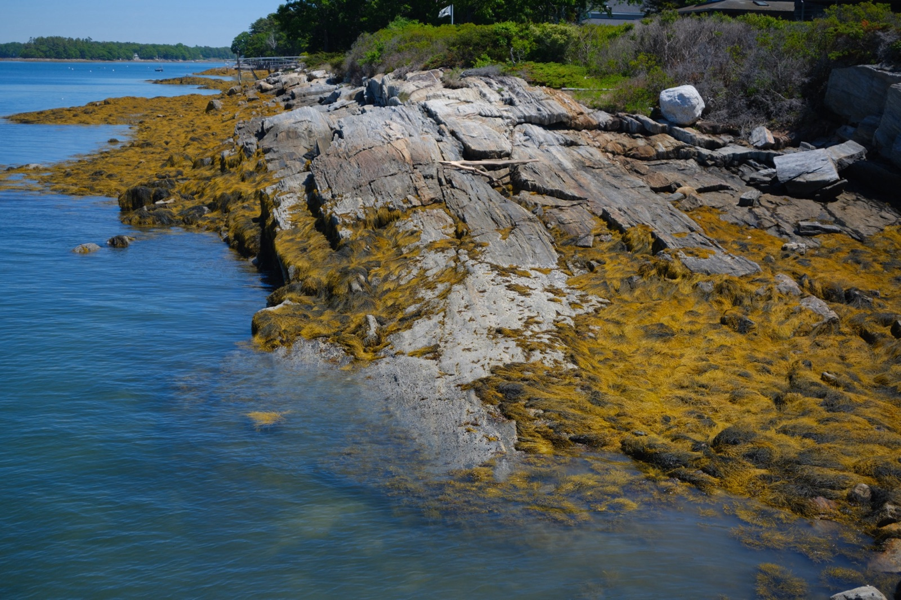
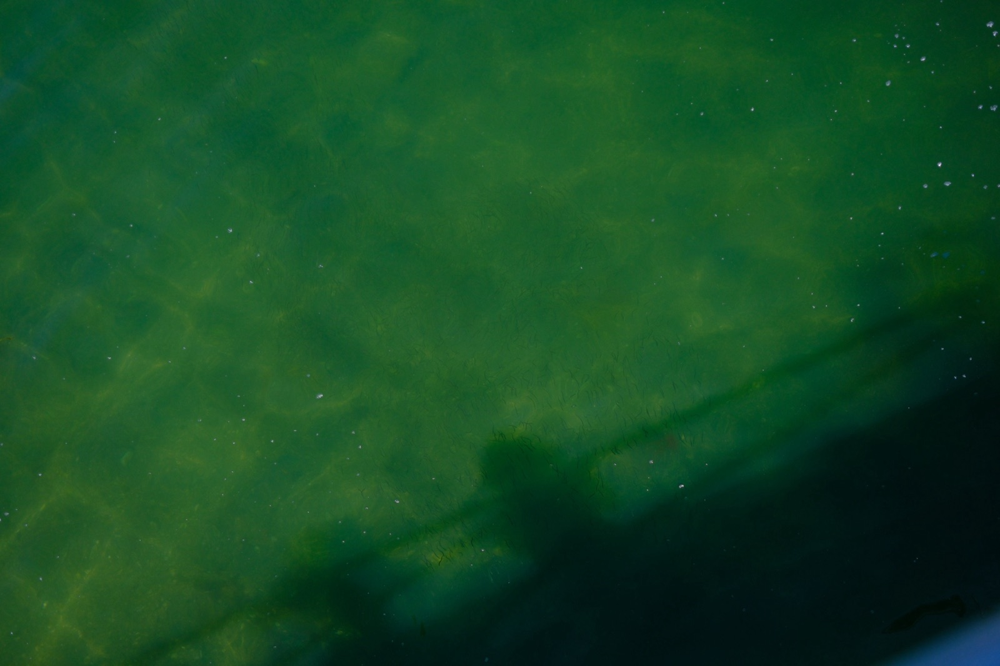
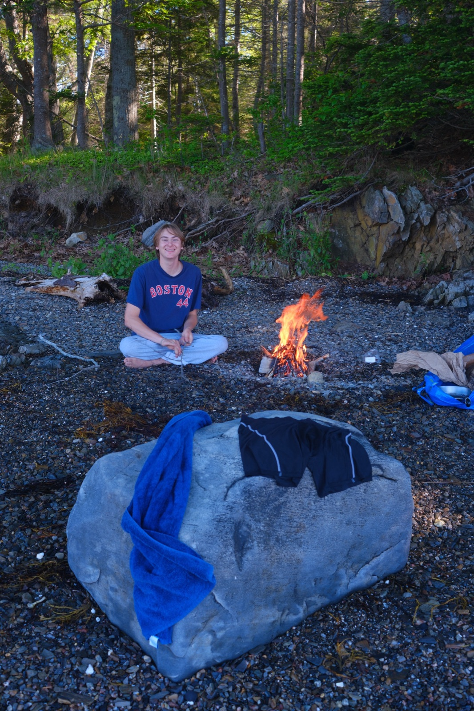
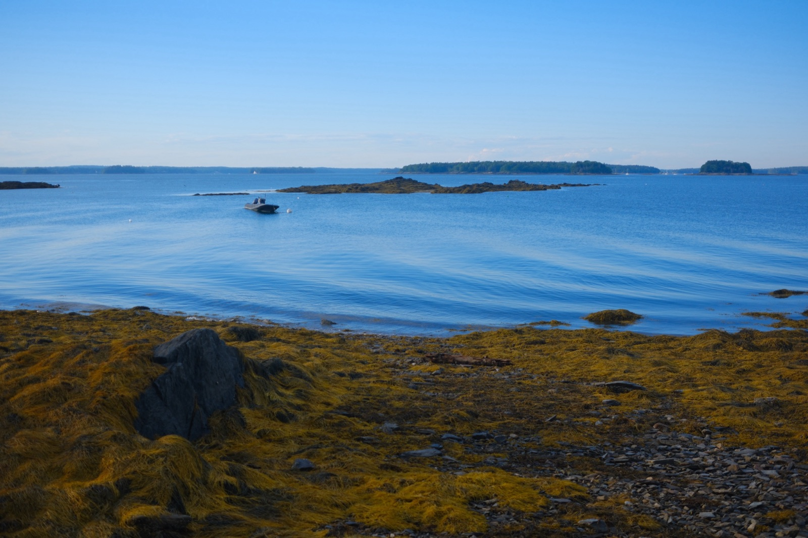
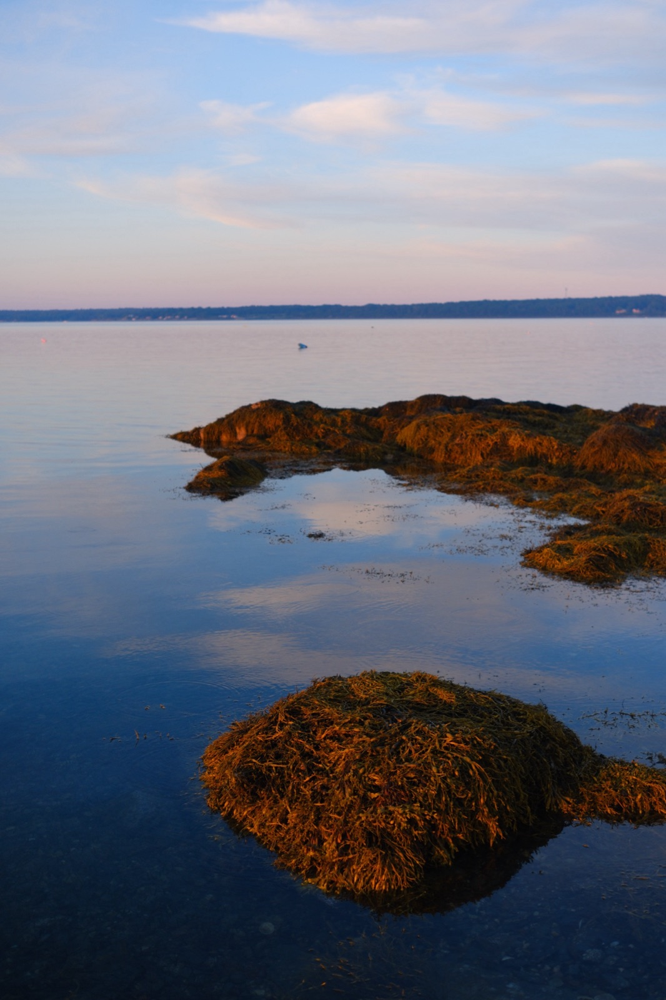

Looking NE from Steamer Dock, Bustins Island, 2026

Town Dock Minnows, Bustins Island, 2026

Quinn tending fire, Little Whaleboat Island, 2026

Black Boat, Little Whaleboat Island, 2026

Looking toward Harpswell, Little Whaleboat Island, 2026

Long exposure campfire, facing NE, Little Whaleboat Island, 2026
